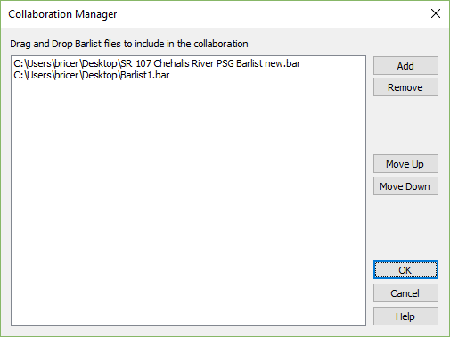

Collaboration Manager {#ug_collaboration}
============
The collaboration manager is availabe in Collaboration projects from Project > Collaboration Manager.

The collaboration manager is used to select and order individual barlist projects into a collaboration project.

Barlist project files can be quickly added to a collabration project by dragging and dropping files onto the collaboration manager window.

The individual groups and bars cannot be edited in a collaboration project. A collaboration project simply creates a unified barlist from one or more individual barlist projects for quantities estimation, reporting, and barlist sheet generation.

[More information...](@ref dlg_collaboration)

