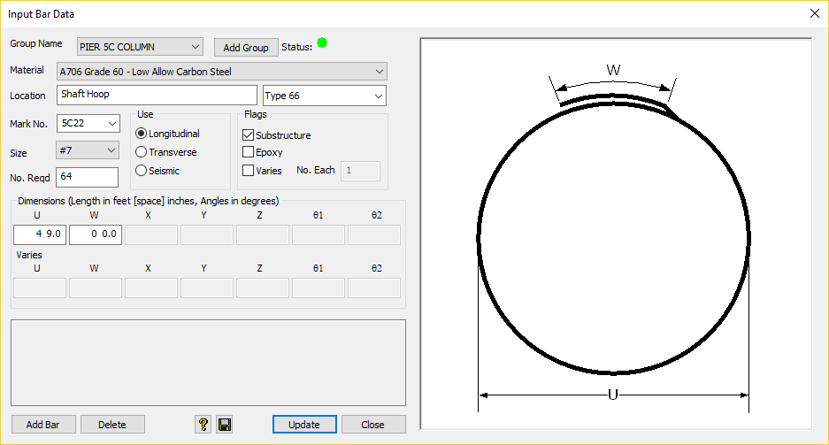

Defining Bars {#ug_bars}
============
Bars are defined in the bar definition window.

The main window is continuously updated as bars are defined and modified.

Bar groups can be selected and created from this window as well. The entire barlist can be defined from this window.

The bend guide shows the bend type input parameters. 

The status of the bar record is indicated with a green, yellow, red status indicator. Status messages for warnings and errors are also provided.

[More information...](@ref dlg_bars)

