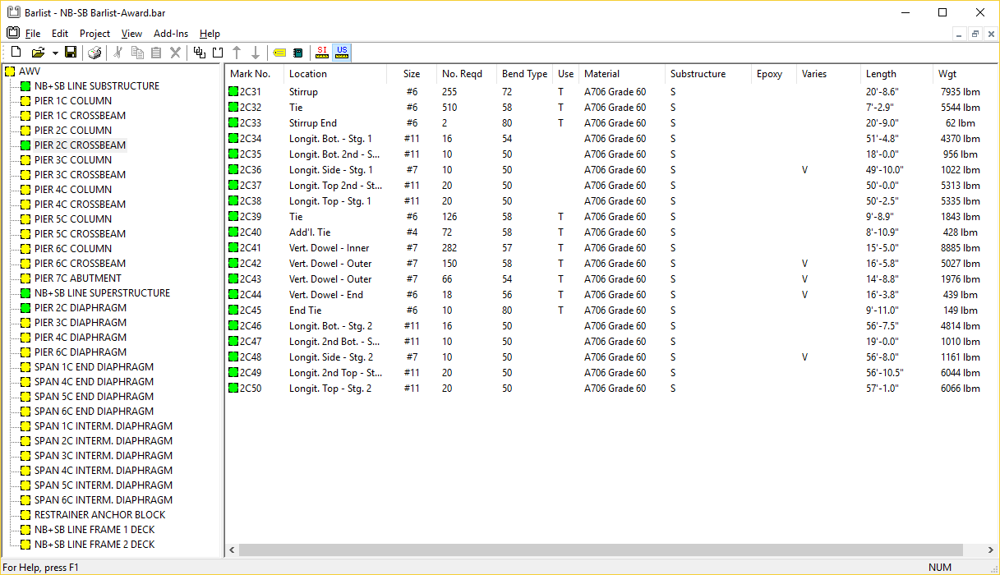

Main Window {#ug_main_window}
============
The main window resembles the Windows Explorer interface. This familiar interface style allows for quick navigate through different groups of bars within a barlist project. Menu, toolbar, and keyboard commands can be used to add, rename, and delete barlist groups and bars, and also to copy/paste barlist bars between groups.

Visual Status Cues
------------------
Visual status cues provide feedback as to the status of the barlist information. These visual cues utilize a "traffic light" configuration to indicate errors, warnings, or neither.  Barlist will evaluate individual bars as they are entered.  If an error is found, a red disk will be displayed at each level within its hierarchy.  If Barlist finds data that is not an obvious error, but does not fit within the expected range of data, or is a potential error, the barlist program will display a yellow warning disk. If no actual, or potential errors are found, a green disk is displayed.

Data Manipulation
-----------------
The data contained within main window may be manipulated with menu commands, keyboard shortcuts, and mouse actions

### Drag and Drop
The bars in the list on the right can be dragged into bar groups in the tree on the left of the main window. Holding the [Ctrl] key down will cause the bars to be copied. 
 

### Cut, Copy, and Paste
By highlighting bars in the list and selecting Cut or Copy from either a right-click pop-up menu, or from the Edit menu, the bars are placed onto the clipboard. The bars can then be pasted into a group on in the tree.
 

### Editing Groups and Mark Numbers
Both groups and bar mark numbers can be edited from the main window. This is done by placing the mouse pointer over the item, pressing the right mouse button, and selecting "Rename Group" or "Edit Mark No." command. 
 

### Deletion
Both groups and bars can be deleted from the main window.  This is done by placing the mouse pointer over the item, pressing the right mouse button, and selecting "Delete", by highlighting the item with the mouse and choosing Edit > Delete from the menu, or by highlighting the item with a mouse click and then pressing the "X" button from the toolbar.
 

### Renumbering Bars
The mark numbers of several bars can be renumbered with the Edit > Generate Mark Numbers command from the main menu or the Renumber Bars command from the context menu. Select one or more bars in the list and choose one of the renumbering commands. Provide the first mark number and the mark number increment and the new mark numbers will be generated.
 

### Sorting
The bars within a group can be sorted by mark number. To perform sorting, press on the list column labeled "Mark No.".
  